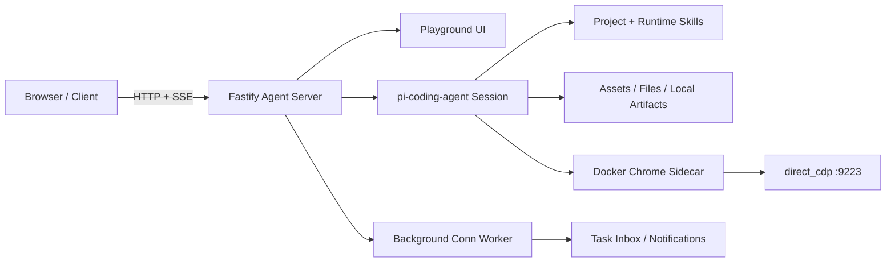

<p align="center">
  
</p>

<h1 align="center">UGK CLAW</h1>

<p align="center">
  A self-hosted HTTP coding agent cockpit built on <code>pi-coding-agent</code>.
  Streaming chat, persistent sessions, file delivery, background jobs, and real browser web access in one Docker-ready runtime.
</p>

<p align="center">
  <a href="./docs/handoff-current.md">Current Handoff</a>
  ·
  <a href="./docs/playground-current.md">Playground Notes</a>
  ·
  <a href="./docs/tencent-cloud-singapore-deploy.md">Deploy Runbook</a>
  ·
  <a href="./docs/change-log.md">Change Log</a>
</p>

---

## Why This Exists

UGK CLAW is an experimental but production-shaped agent server: a browser-accessible workspace where one coding agent can hold long-running conversations, stream its work, keep history across refreshes, deliver files, run scheduled/background tasks, and use a persistent Docker Chrome sidecar for web automation.

It is not a generic SaaS starter kit. It is the infrastructure layer for a practical agent cockpit: stable runtime first, business integrations second.

## Highlights

- **Agent cockpit UI**: a polished `/playground` chat workspace with desktop and mobile layouts, streaming output, resumable active runs, history drawers, file chips, task inbox, and run logs.
- **HTTP-first agent runtime**: Fastify routes for chat, streaming, queueing, interruptions, conversations, files, assets, notifications, background runs, and debug skill discovery.
- **Persistent conversations**: one global current conversation, multiple historical conversations, canonical server state, pagination for older history, and refresh-safe active run recovery.
- **File and artifact delivery**: assets, uploads, local artifact URL rewriting, inline previews, downloads, and `send_file` support for real file handoff.
- **Docker Chrome web access**: default browser automation path is a Linux-friendly Chrome sidecar over CDP, with persistent profile storage for logged-in browsing sessions.
- **Background task foundation**: `conn` runtime, SQLite-backed run storage, notification delivery, task inbox, and Feishu/IM integration shapes reserved for later product work.
- **Deployment-aware docs**: production runbooks, rollback anchors, shared runtime state boundaries, and a change log that records behavior and deployment changes.

## System Shape



Default browser chain:

```text
agent / skill -> direct_cdp -> LocalCdpBrowser -> 172.31.250.10:9223 -> Docker Chrome sidecar
```

## Quick Start

Requirements:

- Node.js 22+
- Docker and Docker Compose
- A `DASHSCOPE_CODING_API_KEY` or compatible `pi-coding-agent` provider setup

Install dependencies:

```bash
npm install
```

Start the local Docker stack:

```bash
docker compose up -d
```

Open:

- Playground: `http://127.0.0.1:3000/playground`
- Health check: `http://127.0.0.1:3000/healthz`
- Chrome sidecar GUI: `https://127.0.0.1:3901/`

For production-style configuration, copy `.env.example` to `.env` and adjust host, public URL, provider credentials, and runtime data directories.

## Useful Commands

```bash
npm run dev
npm test
npm run design:lint
npm run docker:chrome:check
docker compose restart ugk-pi
docker compose -f docker-compose.prod.yml up --build -d
```

Use `restart` for most source changes. Use `up --build -d` when changing `Dockerfile`, dependencies, compose settings, or container-level tools.

## API Surface

Core:

- `GET /healthz`
- `GET /playground`
- `GET /v1/debug/skills`

Chat and conversations:

- `POST /v1/chat`
- `POST /v1/chat/stream`
- `POST /v1/chat/queue`
- `POST /v1/chat/interrupt`
- `GET /v1/chat/status`
- `GET /v1/chat/state`
- `GET /v1/chat/history`
- `GET /v1/chat/events`
- `GET /v1/chat/conversations`
- `POST /v1/chat/conversations`
- `POST /v1/chat/current`
- `POST /v1/chat/reset`

Files and assets:

- `GET /v1/assets`
- `GET /v1/assets/:assetId`
- `GET /v1/files/:fileId`
- `GET /v1/local-file?path=...`
- `GET /runtime/:fileName`

Background tasks and integrations:

- `GET /v1/conns`
- `POST /v1/conns`
- `GET /v1/conns/:connId/runs`
- `GET /v1/conns/:connId/runs/:runId`
- `GET /v1/conns/:connId/runs/:runId/events`
- `POST /v1/conns/:connId/run`
- `POST /v1/integrations/feishu/events`

## Project Map

| Area | Entry |
| --- | --- |
| Server bootstrap | [`src/server.ts`](./src/server.ts) |
| Chat routes | [`src/routes/chat.ts`](./src/routes/chat.ts) |
| Playground route | [`src/routes/playground.ts`](./src/routes/playground.ts) |
| Playground UI | [`src/ui/playground.ts`](./src/ui/playground.ts) |
| Agent orchestration | [`src/agent/agent-service.ts`](./src/agent/agent-service.ts) |
| Session factory | [`src/agent/agent-session-factory.ts`](./src/agent/agent-session-factory.ts) |
| Files and artifacts | [`src/agent/file-artifacts.ts`](./src/agent/file-artifacts.ts) |
| Asset store | [`src/agent/asset-store.ts`](./src/agent/asset-store.ts) |
| Background conn runtime | [`src/agent/conn-store.ts`](./src/agent/conn-store.ts) |
| Worker | [`src/workers/conn-worker.ts`](./src/workers/conn-worker.ts) |
| Docker Chrome sidecar | [`docker-compose.yml`](./docker-compose.yml) |

## Documentation

- [`AGENTS.md`](./AGENTS.md): working rules, current facts, and high-level path index for coding agents.
- [`docs/handoff-current.md`](./docs/handoff-current.md): current handoff snapshot and next-step guidance.
- [`docs/traceability-map.md`](./docs/traceability-map.md): scenario-based map for finding the right code path quickly.
- [`docs/playground-current.md`](./docs/playground-current.md): current playground UI, interaction, and mobile constraints.
- [`docs/runtime-assets-conn-feishu.md`](./docs/runtime-assets-conn-feishu.md): assets, attachments, `send_file`, `conn`, and Feishu runtime notes.
- [`docs/web-access-browser-bridge.md`](./docs/web-access-browser-bridge.md): Chrome sidecar, CDP bridge, persistent profile, and troubleshooting.
- [`docs/server-ops-quick-reference.md`](./docs/server-ops-quick-reference.md): common production operations.
- [`docs/tencent-cloud-singapore-deploy.md`](./docs/tencent-cloud-singapore-deploy.md): Tencent Cloud deployment and rollback runbook.
- [`docs/change-log.md`](./docs/change-log.md): behavior, documentation, and deployment change history.

## Current Status

- Main repository: `https://github.com/mhgd3250905/ugk-claw-personal.git`
- Main branch: `main`
- Current phase: architecture cleanup is considered phase-complete; future work should be driven by real product needs or production issues, not by splitting files for sport.
- Standard verification: `npm test`, `npx tsc --noEmit`, and Docker compose config checks for deployment changes.
- Production updates should use incremental Git-based deployment. Do not replace the whole server directory or wipe shared runtime state.

## Repository Boundaries

Do not commit runtime state:

- `.env`
- `.data/`
- deployment tarballs
- runtime screenshots and generated reports
- temporary local debugging output

The persistent production state lives outside the code checkout. Keep code, configuration, and runtime data separated, or future deployment work gets messy fast.
