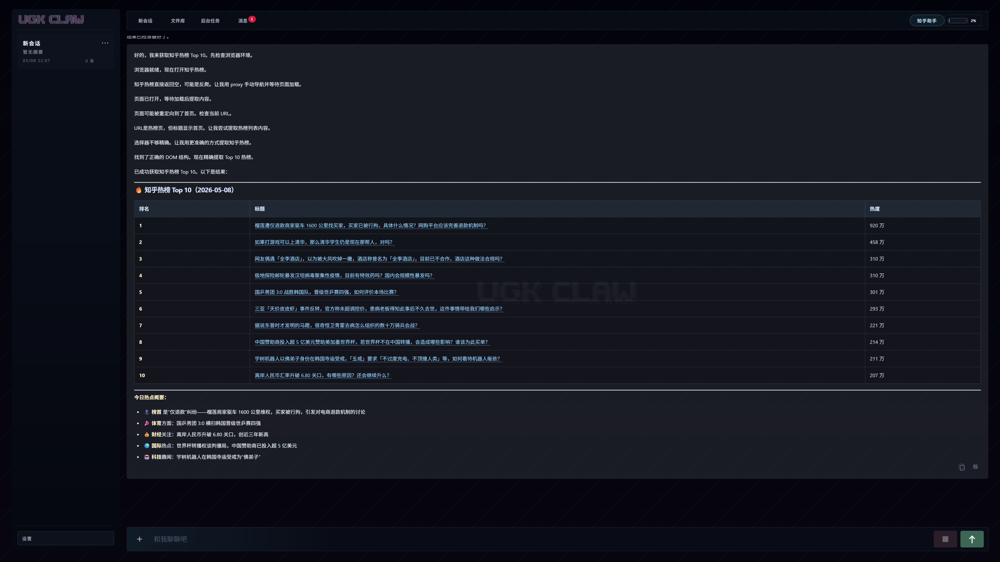
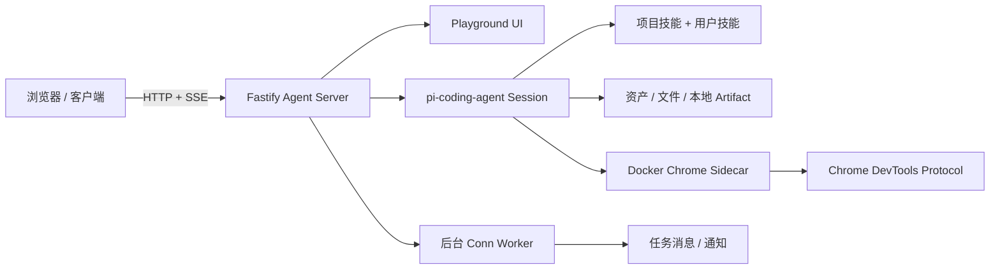
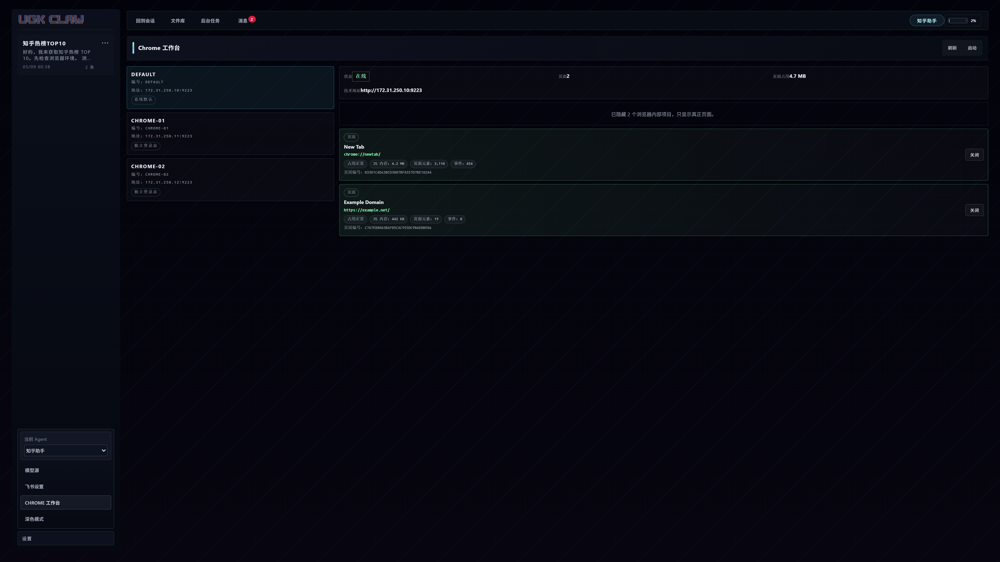

<p align="center">
  
</p>



<h1 align="center">UGK CLAW</h1>

<p align="center">
  <strong>把终端里的 AI Agent 搬进浏览器。<br>它能浏览网页、跑后台任务、交付文件——而且刷新页面不丢会话。</strong>
</p>

<p align="center">
  
  = 22">
  
</p>

<p align="center">
  <a href="./README.md">中文</a>
  ·
  <a href="./README.en.md">English</a>
  ·
  <a href="./docs/playground-current.md">Playground</a>
  ·
  <a href="./docs/server-ops.md">运维手册</a>
  ·
  <a href="./docs/change-log.md">更新记录</a>
</p>

---

## ⚡ 三分钟跑起来

```bash
npm install                    # 安装依赖
docker compose up -d           # 启动 Agent + Chrome Sidecar + SearXNG
open http://127.0.0.1:3000/playground   # 打开工作台
```

> 前提：Node.js 22+、Docker、以及 `DASHSCOPE_CODING_API_KEY` 环境变量。
> 生产环境从 `.env.example` 复制为 `.env`，调整配置后 `docker compose -f docker-compose.prod.yml up --build -d`。

---

## 为什么做这个

市面上不缺 AI 编程工具。但当你需要一个 **在浏览器里长期运行、能操控真实浏览器、刷新不丢状态、能定时执行后台任务** 的 Agent 时，选择其实不多。

大多数方案要么绑在终端里，要么刷新就断，要么不能持久化浏览器登录态。

UGK CLAW 解决的就是这几个问题。它是我们自己的日常工具——跑数据采集、网站监控、定时报告、飞书通知——然后我们把它的接口和 UI 做成了别人也能用的样子。

不是产品，是工作台。不卖，不收费，开源自托管。

---

## ✨ 它能做什么

| | |
|---|---|
| 🖥️ **像聊天软件一样用 Agent** | 桌面端双栏布局 + 手机端适配。流式输出、历史会话、文件卡片、任务消息，刷新不丢运行状态 |
| 🌐 **操控真实浏览器** | Docker Chrome sidecar 方案，profile 持久化。登录一次，后续任务自动复用。三组独立实例互不干扰 |
| ⏰ **定时后台任务** | 创建 Conn 定义周期规则，后台自动执行。跑完通知你，结果归档到任务消息。飞书实时推送 |
| 📦 **生成文件直接交付** | Agent 生成的 HTML 报告、截图、数据文件，一键下载或浏览器预览，不需要手动从容器里拷 |
| 🔌 **HTTP API 全开放** | 所有功能通过 REST + SSE 暴露。聊天、打断、会话管理、文件上传、技能调试——你可以用它做二开集成 |
| 🧩 **多 Agent 共存** | `main` 做编程，`search` 做搜索，自建 Agent 配独立技能集。每个 Agent 独立会话、独立浏览器、互不串场 |

---

## 🏗️ 怎么跑起来的



浏览器请求链路：`Agent → direct_cdp → 172.31.250.10:9223 → Docker Chrome`

<p align="center">
  
</p>

---

## 📰 最近在做什么

- **2026-05-08** — Chrome 工作台 + 多浏览器实例路由：三组独立 Chrome 实例，各自维护登录态，Agent 和后台任务可以指定用哪个浏览器
- **2026-05-07** — v1.2.0：会话支持重命名、置顶、颜色标记；后台任务有了稳定的公开目录；Playground UI 深色 / 浅色双主题收口
- **2026-05-06** — 架构治理收尾：Chat、Agent、Playground UI、Conn 四大模块边界文档 + 测试矩阵落地

[完整更新记录 →](./docs/change-log.md)

---

## 📡 API 速览

<details>
<summary><strong>🔧 基础</strong></summary>

```
GET  /healthz              健康检查
GET  /playground           工作台页面
GET  /v1/debug/skills      技能清单
GET  /v1/debug/runtime     运行态诊断
```

</details>

<details>
<summary><strong>💬 聊天与会话</strong></summary>

```
POST /v1/chat               发送消息
POST /v1/chat/stream        流式请求（SSE）
POST /v1/chat/queue         排队请求
POST /v1/chat/interrupt     打断当前运行
POST /v1/chat/reset         重置会话
GET  /v1/chat/status        运行状态
GET  /v1/chat/state         可渲染状态快照
GET  /v1/chat/events        增量事件订阅
GET  /v1/chat/history       历史消息
GET  /v1/chat/conversations       会话列表
POST /v1/chat/conversations       新建会话
PATCH /v1/chat/conversations/:id  编辑会话
DELETE /v1/chat/conversations/:id 删除会话
POST /v1/chat/current       切换当前会话
```

</details>

<details>
<summary><strong>📦 文件与资产</strong></summary>

```
GET /v1/assets              资产列表
GET /v1/assets/:id          资产详情
GET /v1/files/:id           文件下载
GET /v1/local-file?path=..  本地文件访问
GET /runtime/:name          运行时文件
```

</details>

<details>
<summary><strong>⚙️ 后台任务 & 飞书</strong></summary>

```
GET  /v1/conns              任务列表
POST /v1/conns               创建任务
POST /v1/conns/:id/run       手动触发
GET  /v1/conns/:id/runs      运行记录
GET  /v1/conns/:id/runs/:rid 运行详情
GET  /v1/conns/:id/runs/:rid/events  运行事件流
```

飞书集成：`npm run worker:feishu` 启动 WebSocket 订阅，Playground 内动态配置 App 凭据和接收人。

</details>

---

## 📂 代码地图

| 想改什么 | 从这里开始 |
|---------|-----------|
| 服务入口 / 路由装配 | [`src/server.ts`](./src/server.ts) |
| 聊天 API / 会话管理 | [`src/routes/chat.ts`](./src/routes/chat.ts) |
| Agent 运行生命周期 | [`src/agent/agent-service.ts`](./src/agent/agent-service.ts) |
| Playground 前端 UI | [`src/ui/playground.ts`](./src/ui/playground.ts) |
| 文件上传 / 下载 / 交付 | [`src/agent/file-artifacts.ts`](./src/agent/file-artifacts.ts) |
| 后台任务定义与执行 | [`src/workers/conn-worker.ts`](./src/workers/conn-worker.ts) |
| Docker Chrome 编排 | [`docker-compose.yml`](./docker-compose.yml) |

---

## 📚 文档

| 文档 | 适合谁看 |
|------|---------|
| [`AGENTS.md`](./AGENTS.md) | 接手这个仓库的开发者——规则、约束、关键路径 |
| [`docs/server-ops.md`](./docs/server-ops.md) | 部署和运维的人——更新、验证、回滚 |
| [`docs/playground-current.md`](./docs/playground-current.md) | 改前端 UI 的人——当前交互约束和真实口径 |
| [`docs/traceability-map.md`](./docs/traceability-map.md) | 排查问题时按场景找代码入口 |
| [`docs/architecture-governance-guide.md`](./docs/architecture-governance-guide.md) | 做架构决策的人——模块边界和治理地图 |
| [`docs/change-log.md`](./docs/change-log.md) | 想知道最近改了什么的人 |
| [`docs/web-access-browser-bridge.md`](./docs/web-access-browser-bridge.md) | 浏览器链路排障 |

---

## 📌 运行状态

- **仓库**：[`mhgd3250905/ugk-claw-personal`](https://github.com/mhgd3250905/ugk-claw-personal) · `main` 分支
- **版本**：`v1.2.0` · 腾讯云 + 阿里云双节点生产验证
- **质量闸门**：`npm test` + `npx tsc --noEmit`
- **发布命令**：`npm run server:ops -- <tencent|aliyun> preflight → deploy → verify`

---

## ⚠️ 不要提交这些

`.env` · `.data/` · 部署包 · 运行时截图 · 临时文件

代码归代码，状态归状态。分开管，部署才不出事故。
