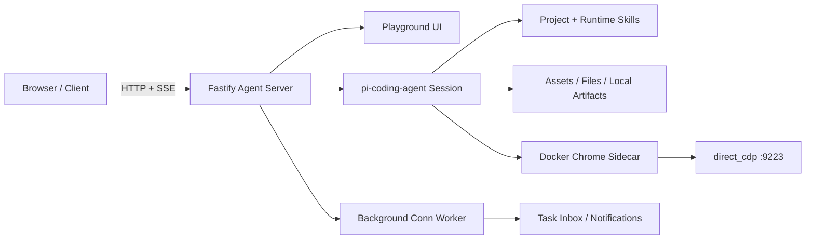

<p align="center">
  
</p>

<h1 align="center">UGK CLAW</h1>

<p align="center">
  <strong>Self-hosted Agent Workbench — chat with AI that browses the web, runs background tasks, and delivers files.</strong>
</p>

<p align="center">
  
  = 22">
  
</p>

<p align="center">
  <a href="./README.md">中文</a>
  ·
  <a href="./README.en.md">English</a>
  ·
  <a href="./docs/playground-current.md">Playground</a>
  ·
  <a href="./docs/server-ops.md">运维</a>
  ·
  <a href="./docs/change-log.md">更新记录</a>
</p>

---

## ⚡ 快速开始

```bash
# 1. 安装依赖
npm install

# 2. 启动全部服务（Agent + Chrome Sidecar + SearXNG）
docker compose up -d

# 3. 打开 Playground
#    → http://127.0.0.1:3000/playground
```

> **需要** Node.js 22+、Docker、以及 `DASHSCOPE_CODING_API_KEY` 环境变量。
> 生产部署从 `.env.example` 复制为 `.env`，按实际环境调整后执行 `docker compose -f docker-compose.prod.yml up --build -d`。

---

## 这是什么

UGK CLAW 是一个 **自托管 HTTP Agent 工作台**。你可以在浏览器里和一个编程 agent 长时间对话：

- 观察它的流式执行过程
- 刷新后恢复运行状态（不丢会话）
- 让它交付真实文件、运行后台定时任务
- 通过 Docker Chrome sidecar 操控真实浏览器（登录态可持久化）

不画大饼，不堆花活。当前阶段只做一件事：**把 agent runtime · 会话 · 流式 · 文件 · 浏览器 · 部署边界跑稳。**

---

## ✨ 能力一览

| | |
|---|---|
| 🖥️ **Agent 工作台 UI** | 桌面 / 手机双布局，流式输出、运行中恢复、历史会话、文件 chip、任务消息、运行日志 |
| 🌐 **HTTP-first API** | 基于 Fastify，聊天、流式、打断、会话、文件、资产、通知、后台 run、技能调试 |
| 💾 **持久会话** | 全局当前会话 + 多条历史 + 服务端 canonical state + 分页历史 + 刷新后 active run 恢复 |
| 📦 **文件交付** | 上传资产、本地 artifact 链接改写、inline 预览、下载、`send_file` 真实文件交付 |
| 🌍 **真实浏览器** | Docker Chrome sidecar + CDP，3 组独立实例 + 持久 profile，适合需登录态的网页自动化 |
| ⚙️ **后台任务** | `conn` runtime + SQLite run 存储 + Agent 选择 + 通知投递 + 任务消息页 |
| 💬 **飞书外挂** | WebSocket worker 作为 Web 当前会话的外挂收发窗口，Playground 内动态配置凭据 |
| 📋 **部署有记录** | 生产 runbook、回滚锚点、change log 全在仓库，不靠聊天记录考古 |

---

## 🏗️ 系统架构



浏览器链路：`agent / skill → direct_cdp → 172.31.250.10:9223 → Docker Chrome sidecar`

---

## 📰 近期动态

- **2026-05-08** — Chrome 工作台 + 多浏览器实例路由落地：default / chrome-01 / chrome-02 三组独立登录态 + scope 路由 + Conn 独立浏览器选择
- **2026-05-07** — v1.2.0 稳定版：会话重命名/置顶/颜色菜单、conn 长期公开目录契约、Playground UI 层级收口
- **2026-05-06** — 架构治理地图完成：Chat/Agent、Playground UI、Conn/Activity 四大域边界文档 + 测试矩阵

---

## 📡 API 速览

<details>
<summary><strong>🔧 基础</strong></summary>

```
GET /healthz
GET /playground
GET /v1/debug/skills
GET /v1/debug/runtime
```

</details>

<details>
<summary><strong>💬 聊天与会话</strong></summary>

```
POST /v1/chat              ·  发送消息
POST /v1/chat/stream       ·  流式请求
POST /v1/chat/queue        ·  排队请求
POST /v1/chat/interrupt    ·  打断运行
POST /v1/chat/reset        ·  重置会话
GET  /v1/chat/status       ·  运行状态
GET  /v1/chat/state        ·  可渲染状态
GET  /v1/chat/events       ·  增量事件
GET  /v1/chat/history      ·  历史消息
GET  /v1/chat/conversations          ·  会话列表
POST /v1/chat/conversations          ·  新建会话
PATCH /v1/chat/conversations/:id     ·  编辑会话
DELETE /v1/chat/conversations/:id    ·  删除会话
POST /v1/chat/current      ·  切换当前会话
```

</details>

<details>
<summary><strong>📦 文件与资产</strong></summary>

```
GET /v1/assets                ·  资产列表
GET /v1/assets/:assetId       ·  资产详情
GET /v1/files/:fileId         ·  文件下载
GET /v1/local-file?path=...   ·  本地文件
GET /runtime/:fileName        ·  运行时文件
```

</details>

<details>
<summary><strong>⚙️ 后台任务与集成</strong></summary>

```
GET  /v1/conns                    ·  Conn 列表
POST /v1/conns                    ·  创建 Conn
POST /v1/conns/:id/run            ·  触发运行
GET  /v1/conns/:id/runs           ·  运行记录
GET  /v1/conns/:id/runs/:rid      ·  运行详情
GET  /v1/conns/:id/runs/:rid/events  ·  运行事件
```

飞书：`npm run worker:feishu` 启动 WebSocket 订阅 worker，Playground 内动态配置凭据。

</details>

---

## 📂 项目地图

| 区域 | 入口 |
|------|------|
| 服务启动 | [`src/server.ts`](./src/server.ts) |
| 聊天路由 | [`src/routes/chat.ts`](./src/routes/chat.ts) |
| Playground UI | [`src/ui/playground.ts`](./src/ui/playground.ts) |
| Agent 编排 | [`src/agent/agent-service.ts`](./src/agent/agent-service.ts) |
| Session 工厂 | [`src/agent/agent-session-factory.ts`](./src/agent/agent-session-factory.ts) |
| 文件交付 | [`src/agent/file-artifacts.ts`](./src/agent/file-artifacts.ts) |
| 后台 conn | [`src/agent/conn-store.ts`](./src/agent/conn-store.ts) |
| 后台 worker | [`src/workers/conn-worker.ts`](./src/workers/conn-worker.ts) |
| Docker Chrome | [`docker-compose.yml`](./docker-compose.yml) |

---

## 📚 文档

| 文档 | 说明 |
|------|------|
| [`AGENTS.md`](./AGENTS.md) | Agent 工作规则、当前事实与场景索引 |
| [`docs/server-ops.md`](./docs/server-ops.md) | 生产运维唯一入口 |
| [`docs/server-ops-quick-reference.md`](./docs/server-ops-quick-reference.md) | 高频运维动作速查 |
| [`docs/playground-current.md`](./docs/playground-current.md) | Playground UI 与交互约束 |
| [`docs/change-log.md`](./docs/change-log.md) | 完整更新记录 |
| [`docs/traceability-map.md`](./docs/traceability-map.md) | 按场景定位代码入口 |
| [`docs/architecture-governance-guide.md`](./docs/architecture-governance-guide.md) | 架构治理接手总入口 |
| [`docs/web-access-browser-bridge.md`](./docs/web-access-browser-bridge.md) | Chrome sidecar 与 CDP 桥接 |
| [`docs/tencent-cloud-singapore-deploy.md`](./docs/tencent-cloud-singapore-deploy.md) | 腾讯云部署手册 |
| [`docs/aliyun-ecs-deploy.md`](./docs/aliyun-ecs-deploy.md) | 阿里云部署手册 |

---

## 📌 当前状态

- **仓库** [`mhgd3250905/ugk-claw-personal`](https://github.com/mhgd3250905/ugk-claw-personal) · **分支** `main`
- **版本** `v1.2.0` · 双云生产（腾讯云 + 阿里云）已验证运行
- 验证命令：`npm test` · `npx tsc --noEmit`
- 生产发布：`npm run server:ops -- <tencent|aliyun> <preflight|deploy|verify>`
- 增量禁区：不 `git reset --hard`、不整目录覆盖、不洗 shared 运行态

---

## ⚠️ 仓库边界

以下内容 **不要提交**：

- `.env` · `.data/` · 部署 tar 包 · 运行时截图/报告 · 本地临时输出

代码、配置、运行态分清楚，部署才不翻车。
