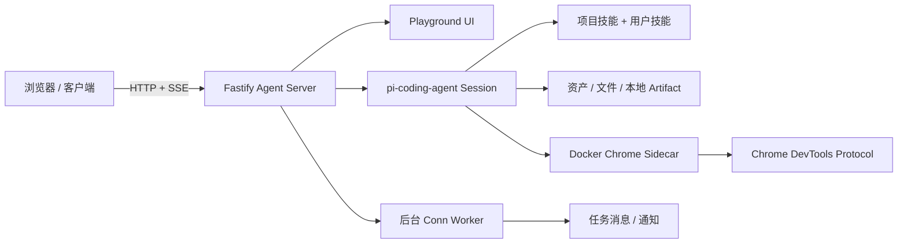

<p align="center">
  
</p>

<p align="center">
  
</p>

<h1 align="center">UGK CLAW</h1>

<p align="center">
  <strong>一个能在浏览器里操控真实 Chrome、跑定时任务、刷新不丢会话的 AI Agent 工作台。</strong><br>
  <sub>自托管 · 开源 · 不卖</sub>
</p>

<p align="center">
  
  = 22">
  
  
</p>

<p align="center">
  <a href="./README.md">中文</a>
  ·
  <a href="./README.en.md">English</a>
  ·
  <a href="./docs/playground-current.md">Playground</a>
  ·
  <a href="./docs/server-ops.md">运维手册</a>
  ·
  <a href="./docs/change-log.md">更新记录</a>
</p>

---

## 为什么选 UGK CLAW

市面上的 AI Agent 工具不少，但大多数要么绑在终端里，要么刷新就断，要么不支持操控真实浏览器。

**UGK CLAW 跟它们不一样：**

| | 典型终端 Agent | 典型 IM Bot Agent | UGK CLAW |
|---|---|---|---|
| 运行界面 | 终端 / IDE | 聊天软件 | **浏览器 Web 工作台** |
| 刷新状态 | 容易丢 | 不丢但不可见 | **刷新后 active run 自动恢复** |
| 操控浏览器 | 无或受限 | 无 | **Docker Chrome sidecar，profile 持久化，登录态复用** |
| 多浏览器隔离 | — | — | **3 组独立 Chrome 实例，互不干扰** |
| 定时后台任务 | 手动 | 简单 cron | **Conn 系统：定时 + Agent 选择 + 通知 + 飞书推送** |
| 文件交付 | 手动拷 | 发文件 | **Agent 生成 → 一键下载/预览，不需要进容器** |
| 多 Agent | — | 部分支持 | **main/search/自定义，独立会话和浏览器，互不串场** |
| API 开放 | CLI only | 有限 | **全功能 REST + SSE，可做二开集成** |
| 中文生态 | 无 | 部分 | **飞书深度集成，Playground 内动态配置** |
| 部署 | 本地 | 云端 | **腾讯云 + 阿里云双节点生产验证** |

简单说：如果你需要的是一个**真正能帮你干活**的 Agent——能在浏览器里长期运行、操控真实网页、定时执行任务、生成文件直接交付、刷新不丢上下文——那 UGK CLAW 就是为你准备的。

它是我们自己在用的工具，每天跑数据采集、网站监控、定时报告。我们把它做成了别人也能跑起来的样子。

---

## ⚡ 三分钟跑起来

```bash
git clone https://github.com/mhgd3250905/ugk-claw-personal.git
cd ugk-claw-personal
npm install
docker compose up -d
# 打开 http://127.0.0.1:3000/playground
```

> 需要 Node.js 22+、Docker、`DASHSCOPE_CODING_API_KEY`。生产部署从 `.env.example` 复制为 `.env`，`docker compose -f docker-compose.prod.yml up --build -d`。

---

## 怎么用

### 日常对话 + 编程

在 Playground 里像聊天一样跟 Agent 对话。它能写代码、查文件、改配置，所有操作在浏览器里实时可见。

### 操控浏览器

Agent 通过 Docker Chrome sidecar 打开真实网页，登录态持久化。三组独立 Chrome 实例（default / chrome-01 / chrome-02），各自维护各自的 cookie 和 session。

```
帮我打开 GitHub 看最近的 issue，汇总到报告里
登录飞书后台导出昨天的数据
```

### 定时后台任务

创建 Conn，设好周期规则，Agent 到点自动执行。跑完通知你，结果归档到任务消息。

```
每天早上 9 点抓取 Hacker News 首页，总结 Top 10 发到飞书
每小时检查一次网站是否在线，挂了立刻通知
```

### 文件交付

Agent 生成的 HTML 报告、截图、数据文件，在聊天里直接点击下载或浏览器预览。不需要 `docker cp`、不需要进容器找路径。

### 飞书集成

启动 `npm run worker:feishu`，在 Playground 里配置 App 凭据。Agent 的消息、任务结果、通知实时推送到飞书。

---

## ✨ 能力一览

| | |
|---|---|
| 🖥️ **Web 工作台** | 桌面双栏 + 手机适配。流式输出、历史会话、文件卡片、任务消息、运行日志。刷新不丢状态 |
| 🌐 **真实浏览器** | Docker Chrome sidecar + CDP。3 组独立实例，profile 持久化，登录一次后续复用 |
| ⏰ **后台任务** | Conn 系统：定义周期规则 → 自动执行 → 通知投递 → 飞书推送。支持 Agent 选择 + 浏览器绑定 |
| 📦 **文件交付** | Agent 生成 → 一键下载/预览。HTML 报告、截图、数据文件，聊天里直接交付 |
| 🔌 **全功能 API** | REST + SSE。聊天、打断、会话管理、文件上传、技能调试——所有功能都对外开放 |
| 🧩 **多 Agent 共存** | `main` 编程、`search` 搜索、自建 Agent 配独立技能。独立会话、独立浏览器、互不串场 |
| 💬 **飞书深度集成** | WebSocket worker 外挂收发窗口，Playground 内动态配置凭据和接收人 |

---

## 🏗️ 架构



浏览器链路：`Agent → direct_cdp → 172.31.250.10:9223 → Docker Chrome`

<p align="center">
  
</p>

### 关键文件

| 想改什么 | 从这里开始 |
|---------|-----------|
| 服务入口 / 路由装配 | [`src/server.ts`](./src/server.ts) |
| 聊天 API / 会话管理 | [`src/routes/chat.ts`](./src/routes/chat.ts) |
| Agent 运行生命周期 | [`src/agent/agent-service.ts`](./src/agent/agent-service.ts) |
| Playground 前端 UI | [`src/ui/playground.ts`](./src/ui/playground.ts) |
| 文件上传 / 下载 / 交付 | [`src/agent/file-artifacts.ts`](./src/agent/file-artifacts.ts) |
| 后台任务定义与执行 | [`src/workers/conn-worker.ts`](./src/workers/conn-worker.ts) |
| Docker Chrome 编排 | [`docker-compose.yml`](./docker-compose.yml) |

---

## ❓ FAQ

<details>
<summary><strong>UGK CLAW 跟 OpenClaw / NanoClaw 有什么区别？</strong></summary>

它们都是优秀的 Agent 项目。UGK CLAW 的核心差异在于：**Web 工作台优先**——它不是一个后台 service，而是一个你可以在浏览器里打开、观察、交互的工作台。另一个独特卖点是**真实浏览器操控**：Docker Chrome sidecar 方案让 Agent 能操控真实网页并持久化登录态，三组独立实例互不干扰。
</details>

<details>
<summary><strong>为什么用 Docker Chrome 而不是 headless？</strong></summary>

因为我们经常需要**登录态的网站自动化**——飞书后台、GitHub、各类 SaaS 工具。headless 模式对登录态的支持不稳定，而 Docker Chrome sidecar 提供完整的浏览器环境，profile 持久化，登录一次后续任务自动复用。
</details>

<details>
<summary><strong>刷新页面真的不丢会话吗？</strong></summary>

真的。服务端维护 canonical state，刷新后 `GET /v1/chat/state` + `GET /v1/chat/events` 恢复 active run 的增量流。这是整个系统设计的基础假设之一。
</details>

<details>
<summary><strong>能在 Windows 上跑吗？</strong></summary>

能。Docker Desktop 提供跨平台支持。我们在 Windows 上开发，生产部署在 Linux（腾讯云 + 阿里云）。
</details>

<details>
<summary><strong>安全吗？暴露到公网需要注意什么？</strong></summary>

Agent 运行在 Docker 容器内，隔离性由 Docker 保证。暴露到公网时建议：
- 配置 nginx 反向代理 + HTTPS
- 不要在生产环境暴露 Chrome sidecar GUI 端口
- 生产部署参考 [`docs/server-ops.md`](./docs/server-ops.md)
</details>

<details>
<summary><strong>能用其他模型吗？</strong></summary>

支持阿里（DashScope）、DeepSeek、小米（MiMo）三种模型源。在 Playground 的模型设置里切换。
</details>

---

## 📚 文档

| 文档 | 谁该看 |
|------|-------|
| [`AGENTS.md`](./AGENTS.md) | 接手这个项目的开发者 |
| [`docs/server-ops.md`](./docs/server-ops.md) | 部署和运维的人 |
| [`docs/playground-current.md`](./docs/playground-current.md) | 改前端 UI 的人 |
| [`docs/traceability-map.md`](./docs/traceability-map.md) | 按场景找代码入口 |
| [`docs/architecture-governance-guide.md`](./docs/architecture-governance-guide.md) | 做架构决策的人 |
| [`docs/change-log.md`](./docs/change-log.md) | 想知道最近改了什么 |
| [`docs/web-access-browser-bridge.md`](./docs/web-access-browser-bridge.md) | 浏览器链路排障 |

---

## 👥 社区 & 贡献

项目目前由 [@mhgd3250905](https://github.com/mhgd3250905) 维护，不设 roadmap，不做 feature voting。真实需求驱动开发，线上问题优先修复。

欢迎提 Issue 和 PR。改动前建议先看 [`AGENTS.md`](./AGENTS.md) 了解项目规范。

---

## 📌 状态

- **仓库**：[`mhgd3250905/ugk-claw-personal`](https://github.com/mhgd3250905/ugk-claw-personal) · `main`
- **版本**：`v1.2.0` · 腾讯云 + 阿里云双节点生产验证
- **验证**：`npm test` + `npx tsc --noEmit`
- **发布**：`npm run server:ops -- <tencent|aliyun> preflight → deploy → verify`

---

`.env` · `.data/` · 部署包 · 截图 · 临时文件 —— **不要提交。** 代码归代码，状态归状态。
