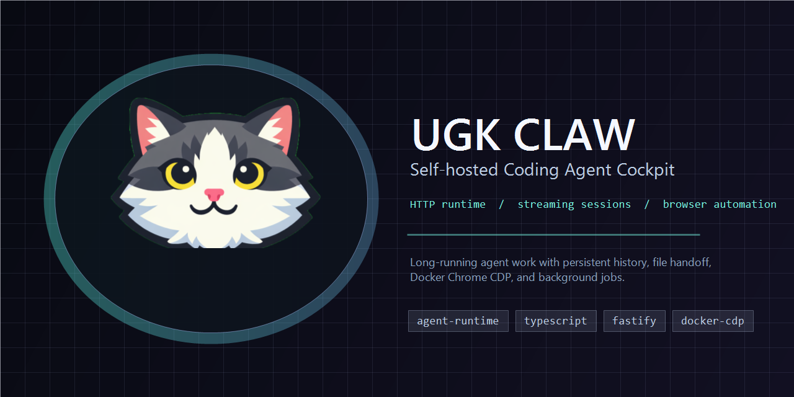
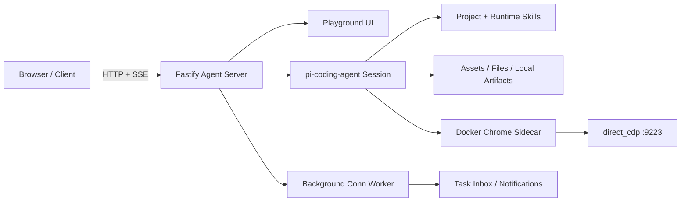

<p align="center">
  
</p>

<h1 align="center">UGK CLAW</h1>

<p align="center">
  一个自托管 HTTP 编程 Agent 工作台，基于 <code>pi-coding-agent</code> 构建。
  支持流式对话、持久会话、文件交付、后台任务，以及可登录态持久化的真实浏览器访问。
</p>

<p align="center">
  <a href="./README.md">中文</a>
  |
  <a href="./README.en.md">English</a>
</p>

<p align="center">
  <a href="#文档导航">文档导航</a>
  |
  <a href="./docs/playground-current.md">Playground 说明</a>
  |
  <a href="./docs/server-ops.md">服务器运维</a>
  |
  <a href="./docs/change-log.md">更新记录</a>
</p>

---

## 这是什么

UGK CLAW 是一个面向真实使用场景的 Agent Server 原型：你可以在浏览器里和一个编程 agent 长时间对话，观察它的流式执行过程，刷新后恢复运行状态，让它交付文件、运行后台任务，并通过 Docker Chrome sidecar 使用真实浏览器完成 web 自动化。

它不是通用后台脚手架，也不是又一个“先画大饼再补 runtime”的玩具项目。当前重点很明确：先把 agent runtime、会话、流式输出、文件交付、浏览器访问和部署边界跑稳，再接业务集成。这个顺序比较朴素，但至少不骗人。

## 核心亮点

- **Agent 工作台 UI**：`/playground` 提供桌面端和手机端布局，支持流式输出、运行中恢复、历史会话、文件 chip、任务消息和运行日志。
- **HTTP-first runtime**：基于 Fastify 暴露聊天、流式、队列、打断、会话、文件、资产、通知、后台 run 和技能调试接口。
- **持久会话机制**：一个全局当前会话、多条历史会话、服务端 canonical state、旧历史分页，以及刷新后的 active run 恢复。
- **文件与 artifact 交付**：支持上传资产、本地 artifact 链接改写、inline 预览、下载，以及 `send_file` 真实文件交付。
- **Docker Chrome 真实浏览器链路**：默认走 Linux 友好的 Chrome sidecar + CDP，浏览器 profile 可持久化，适合需要登录态的网站自动化。
- **后台任务与飞书外挂窗口**：内置 `conn` runtime、SQLite run 存储、通知投递、任务消息页；飞书通过 WebSocket worker 作为 Web 当前会话的外挂收发窗口，并支持在 playground 动态配置 App 凭据和接收人。
- **部署与交接有记录**：生产 runbook、回滚锚点、共享运行态边界和 change log 都在仓库里，避免靠聊天记录考古。

## 系统结构



默认浏览器链路：

```text
agent / skill -> direct_cdp -> LocalCdpBrowser -> 172.31.250.10:9223 -> Docker Chrome sidecar
```

## 快速开始

环境要求：

- Node.js 22+
- Docker 和 Docker Compose
- `DASHSCOPE_CODING_API_KEY`，或兼容 `pi-coding-agent` 的 provider 配置

安装依赖：

```bash
npm install
```

启动本地 Docker 栈：

```bash
docker compose up -d
```

打开入口：

- Playground：`http://127.0.0.1:3000/playground`
- 健康检查：`http://127.0.0.1:3000/healthz`
- Chrome sidecar GUI：`https://127.0.0.1:3901/`

生产风格配置可以从 `.env.example` 复制为 `.env`，再按实际环境调整 host、public URL、provider credentials 和运行态目录。

## 常用命令

```bash
npm run dev
npm test
npm run design:lint
npm run docker:chrome:check
npm run server:ops -- tencent preflight
npm run server:ops -- aliyun preflight
docker compose restart ugk-pi
docker compose -f docker-compose.prod.yml up --build -d
```

多数源码改动只需要 `restart`。如果改了 `Dockerfile`、依赖、compose 配置或容器内系统工具，就别偷懒，使用 `up --build -d`。

## API 速览

基础：

- `GET /healthz`
- `GET /playground`
- `GET /v1/debug/skills`

聊天与会话：

- `POST /v1/chat`
- `POST /v1/chat/stream`
- `POST /v1/chat/queue`
- `POST /v1/chat/interrupt`
- `GET /v1/chat/status`
- `GET /v1/chat/state`
- `GET /v1/chat/history`
- `GET /v1/chat/events`
- `GET /v1/chat/conversations`
- `POST /v1/chat/conversations`
- `POST /v1/chat/current`
- `POST /v1/chat/reset`

文件与资产：

- `GET /v1/assets`
- `GET /v1/assets/:assetId`
- `GET /v1/files/:fileId`
- `GET /v1/local-file?path=...`
- `GET /runtime/:fileName`

后台任务与集成：

- `GET /v1/conns`
- `POST /v1/conns`
- `GET /v1/conns/:connId/runs`
- `GET /v1/conns/:connId/runs/:runId`
- `GET /v1/conns/:connId/runs/:runId/events`
- `POST /v1/conns/:connId/run`
- 飞书入站不再暴露 HTTP webhook；通过 `npm run worker:feishu` 启动 WebSocket 订阅 worker。`FEISHU_APP_ID` / `FEISHU_APP_SECRET` 只作为首次启动兜底，部署后可在 playground 的“飞书设置”里动态保存并触发 worker 自动重连。

## 项目地图

| 区域 | 入口 |
| --- | --- |
| 服务启动 | [`src/server.ts`](./src/server.ts) |
| 聊天路由 | [`src/routes/chat.ts`](./src/routes/chat.ts) |
| Playground 路由 | [`src/routes/playground.ts`](./src/routes/playground.ts) |
| Playground UI | [`src/ui/playground.ts`](./src/ui/playground.ts) |
| Agent 编排 | [`src/agent/agent-service.ts`](./src/agent/agent-service.ts) |
| Session 工厂 | [`src/agent/agent-session-factory.ts`](./src/agent/agent-session-factory.ts) |
| 文件与 artifact | [`src/agent/file-artifacts.ts`](./src/agent/file-artifacts.ts) |
| 资产存储 | [`src/agent/asset-store.ts`](./src/agent/asset-store.ts) |
| 后台 conn runtime | [`src/agent/conn-store.ts`](./src/agent/conn-store.ts) |
| 后台 worker | [`src/workers/conn-worker.ts`](./src/workers/conn-worker.ts)、[`src/workers/feishu-worker.ts`](./src/workers/feishu-worker.ts) |
| Docker Chrome sidecar | [`docker-compose.yml`](./docker-compose.yml) |

## 文档导航

- [`AGENTS.md`](./AGENTS.md)：agent 工作规则、当前事实和关键路径索引。
- [`README.en.md`](./README.en.md)：英文版 README。
- [`docs/handoff-current.md`](./docs/handoff-current.md)：历史交接快照，保留用于理解 `2026-04-27` 当时状态；不要当作当前部署事实入口。
- [`docs/traceability-map.md`](./docs/traceability-map.md)：按场景定位代码入口。
- [`docs/playground-current.md`](./docs/playground-current.md)：当前 playground 的 UI、交互和手机端约束。
- [`docs/model-providers.md`](./docs/model-providers.md)：阿里、DeepSeek、小米三类模型源的 provider、region、key 和展示顺序。
- [`docs/runtime-assets-conn-feishu.md`](./docs/runtime-assets-conn-feishu.md)：资产、附件、`send_file`、`conn` 和 Feishu 运行说明。
- [`docs/web-access-browser-bridge.md`](./docs/web-access-browser-bridge.md)：Chrome sidecar、CDP bridge、持久 profile 和排障口径。
- [`docs/server-ops.md`](./docs/server-ops.md)：生产服务器更新、检查和验收的唯一入口。
- [`docs/server-ops-quick-reference.md`](./docs/server-ops-quick-reference.md)：生产环境高频运维动作。
- [`docs/tencent-cloud-singapore-deploy.md`](./docs/tencent-cloud-singapore-deploy.md)：腾讯云部署、更新、验收和回滚手册。
- [`docs/aliyun-ecs-deploy.md`](./docs/aliyun-ecs-deploy.md)：阿里云 ECS 部署、验证和接手手册。
- [`docs/playground-runtime-refactor-summary-2026-04-22.md`](./docs/playground-runtime-refactor-summary-2026-04-22.md)：历史阶段总结，仅在继续排查 playground runtime 拆分背景时阅读。
- [`docs/change-log.md`](./docs/change-log.md)：行为、文档和部署更新记录。

## 当前状态

- 主仓库：`https://github.com/mhgd3250905/ugk-claw-personal.git`
- 主分支：`main`
- 当前阶段：架构整理已阶段性完成；后续工作应该由真实产品需求或线上问题驱动，不要为了拆文件而拆文件。
- 标准验证：`npm test`、`npx tsc --noEmit`，涉及部署时再加 Docker compose config 校验。
- 生产更新默认走 `npm run server:ops -- <tencent|aliyun> preflight/deploy/verify`。两边都不要洗掉 shared runtime state，尤其是 `.data`、Chrome profile 和 `runtime/skills-user`。

## 仓库边界

不要提交运行态：

- `.env`
- `.data/`
- 部署 tar 包
- 运行时截图和生成报告
- 本地临时调试输出

生产持久状态应该放在代码 checkout 之外。代码、配置、运行态分清楚，后面部署才不会变成大型猜谜现场。
